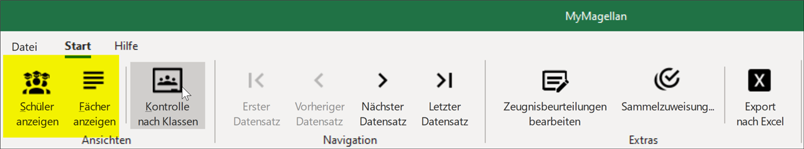
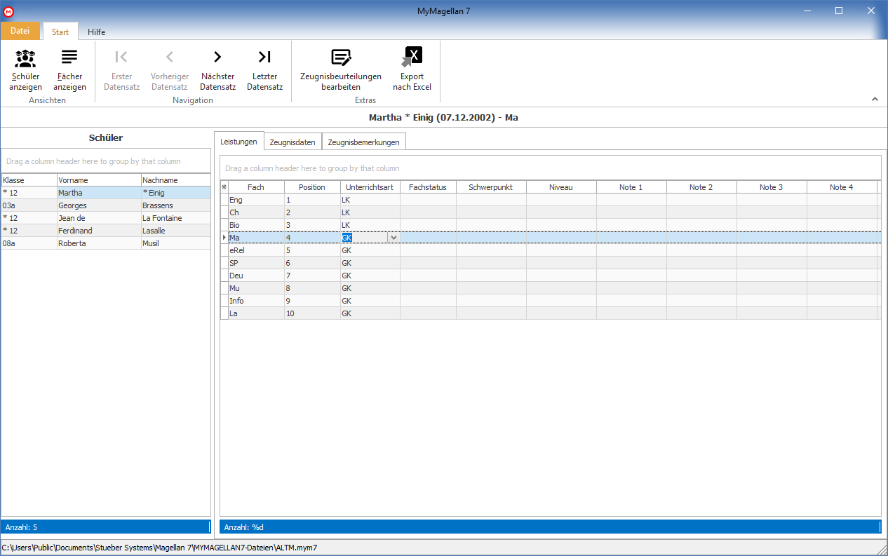
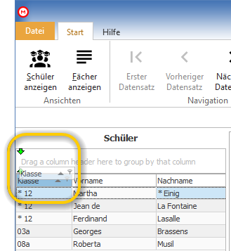
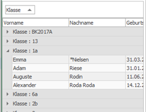
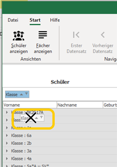
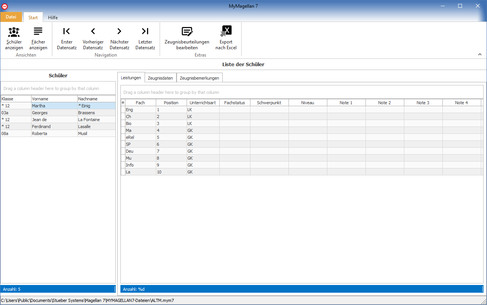

# Noteneingabe

Öffnen Sie MyMAGELLAN per Doppelklick auf Ihre Datei (*.mym) oder starten Sie das Programm MyMAGELLAN  und laden über `Datei > Öffnen`.
Es gibt zwei Ansichten für die Eingabe, einmal für die Datenerfassung je Schüler (Leistungen, weitere Zeugnisdaten, Zeugnisbemerkugne, Fehlzeitern) oder aus Sicht eines Faches (Leistungen).

 
 

## Eingabe nach Schülern

In dieser Ansicht ist das Fenster zweigeteilt: links ist die Liste der Schüler, auf der rechten Seite werden je nach Unterkarte die Daten erfasst. 
Die Schüler, die auf der linken Seite gezeigt werden, können gefiltert, gruppiert oder sortiert werden.

### Die Schülerauswahlspalte

Die Leiste auf der linken Seite des Fensters zeigt Ihnen die Schüler, für die Sie Daten erfassen können. Es gibt einige Möglichkeiten diese Liste und auch andere Ansichten zu filtern, zu sortieren, zu gruppieren usw. Wir beschreiben die Funktionalitäten stellvertretend für alle Ansichten anhand dieser Schülerliste.

#### Sortieren, Gruppieren, Filtern usw.
Aktion| Wie geht es?
--|--
Sortieren|Klicken Sie mit der linken Maustaste auf einen der Spaltenköpfe, die Inhalte der Spalte werden auf- oder absteigend sortiert.   Beispiel: Sie klicken auf den Spaltenkopf der Spalte Klasse, die Klassen werden beim ersten Klick aufsteigend sortiert, beim erneuten Klick wird die Reihenfolge umgekehrt.
Mehrfachsortierung | Möchten Sie, dass die Schüler nach den Klassen sortiert werden und aber auch innerhalb der Klasse in alphabethischer Reihenfolge gezeigt werden, klicken Sie als erstes auf den Spaltenkopf der Spalte Klasse, halten anschließend die SHIFT-Taste fest und klicken dann auf den Spaltenkopf der Spalte Nachname. 
Gruppieren|Zum Gruppieren ziehen Sie den Spaltenkopf der Spalte mit gedrückter Maustaste hoch wie in der Abbildung.   Die einzelnen Zeilen werden je nach Inhalt gruppiert, über die kleinen Dreiecke vor der Bezeichnung kann man eine Gruppierung öffnen oder schließen.    Um eine Gruppierung wieder aufzuheben, ziehen Sie den Spaltenkopf der gruppierten Spalte soweit nach unten, dass ein Kreuz gezeigt wird und lassen los.  
Filtern|
Filtern|
inkrementelle Suche|

* Klassensichtweise: Bei der Klassensichtweise finden Sie eine Auflistung aller Klassen, zu denen Sie Noten, [bei Standard nicht enthalten] Notendetails bzw. [bei Standard nicht enthalten] Zeugnisbemerkungen eingeben müssen. Nach Auswahl einer Klasse können Sie schülerweise und/oder fachweise vorgehen.

* Schülersichtweise: Bei der Schülersichtweise werden alle Schüler insgesamt aufgelistet und Sie können nach Auswahl eines Schüler nur dessen Noten, [bei Standard nicht enthalten] Notendetails bzw. [bei Standard nicht enthalten] Zeugnisbemerkungen eingeben.

* Fächersichtweise: Bei der Fächersichtweise finden Sie eine Auflistung aller Fächer bzw. Kurse, zu denen Sie Noten, [bei Standard nicht enthalten] Notendetails bzw. [bei Standard nicht enthalten] Zeugnisbemerkungen eingeben müssen. Nach Auswahl eines Fachs/Kurses können Sie für die einzelnen Schüler des Kurses Ihre Eingaben vornehmen.

Welche Sichtweise Sie für Ihre Eingaben verwenden bleibt Ihnen überlassen. Selbstverständlich können Sie auch zwischen den Sichtweisen wechseln.

Alle Eingaben beruhen auf zuvor in MAGELLAN festgelegten Schlüsselverzeichnissen für Noten und Zeugnisbemerkungen.

Die Eingabe von selbst definierten Noten oder Veränderung von Schülerstammdaten ist nicht möglich! Wenden Sie sich in diesem Fall an Ihren Administrator.

## Eingabe der Noten aus Klassensicht

Um die Noten aus Klassensicht einzugeben, müssen Sie wie folgt vorgehen.

1. Klicken Sie auf Ansicht und dann auf Klassen anzeigen.

2. Doppelklicken Sie auf eine Zeile der Liste der Klassen auf der Registerkarte  Auswahl.

3. Sie befinden Sie jetzt auf der Registerkarte Schüler-Matrix.

### Registerkarte Schüler-Matrix

Auf der Registerkarte Schüler-Matrix sind alle Schüler der Klasse aufgelistet. 

<figure class="center">
    
    <figcaption>Registerkarte <em>Schüler-Matrix</em> mit der Liste der Schüler in der Klasse</figcaption>
</figure>

Markieren Sie einen Schüler, so werden die untergeordneten Registerkarten Leistungen und Weitere Daten mit den Daten des Schülers gefüllt.

Auf der Registerkarte Leistungen werden alle Fächer des Schülers aufgelistet. Geben Sie hier in den eingeblendeten Spalten die notwendigen Werte ein.

Hier kann der Lehrer beim Schüler auch optional den Tutor bzw. Fachlehrer sehen.
Über die Pfeiltasten können Sie zum nächsten oder vorherigen Schüler wechseln.
 
<figure class="center">
    
    <figcaption>Registerkarte <em>Leistungen</em> auf der Registerkarte <em>Schüler-Matrix</em></figcaption>
</figure>
 
!!! info "Hinweis"

	Die Schüler-Matrix Leistungen kann nach Excel exportiert werden.

Auf der Registerkarte Weitere Daten können zusätzliche Informationen für das Zeugnis festgehalten werden Neben den Fehltagen und Fehlstunden können Sie auch die Zeugnisbemerkungen des Schülers bestimmen. [Bei Standard nicht enthalten]
 
<figure class="center">
    
    <figcaption>Registerkarte <em>Weitere Daten</em> auf der Registerkarte <em>Schüler-Matrix</em></figcaption>
</figure>
 
Es gibt hier ein zusätzliches Optionsfeld „Keine Unterrichtstage, Versäumnisse, Fehltage usw...“

Markieren Sie diesen Feld, so werden die Werte für Unterrichtstage, Ver¬säumnisse, Fehltage, Fehltage unentschuldigt, Fehlstunden und Fehlstunden unentschuldigt als leere Felder in der MyMAGELLAN-Datei gespeichert. Beim Einlesen der Daten nach MAGELLAN werden diese Felder nicht berücksichtigt und führen somit auch zu keinen Veränderungen bestehender Eingaben.

!!! info "Hinweis"

	In MyMAGELLAN eingetragene Zeugnisbemerkungen werden nur nach MAGELLAN importiert, wenn der Lehrer auch Klassenleiter1 der Klasse ist.

So fügen Sie eine Zeugnisbemerkung ein:

1. Klicken Sie auf Hinzufügen.

2. Legen Sie im Dialogfenster Zeugnisbemerkung unter Text den Inhalt der Bemerkung fest. Sie können dazu auf Textbausteine über die Schaltfläche Aus Verzeichnis wählen zurückgreifen, sofern diese zuvor in MAGELLAN definiert worden sind.

3. Legen Sie optional ein Merkmal bzw. eine Position der Bemerkung fest.

4. Klicken Sie auf OK.
 

<figure class="center">
    
    <figcaption>Dialogfenster <em>Zeugnisbemerkungen</em></figcaption>
</figure>

### Registerkarte Fächer-Matrix

Auf der Registerkarte Fächer-Matrix sind alle Schüler der Klasse aus Sichtweise der vergebenen Fächer in der aktuellen Klasse aufgelistet. Durch Doppelklicken auf eine Zeile in der Liste der Fächer findet man auf der rechten Seite die Liste aller Schüler, die in diesem Fach unterrichtet werden. Sie können so fachweise die Leistungen eintragen.

<figure class="center">
    
    <figcaption>Registerkarte <em>Fächer-Matrix</em></figcaption>
</figure>

!!! info "Hinweis"

	Die Fächer-Matrix kann nach Excel exportiert werden.

## Eingabe der Noten aus Schülersicht

Um die Noten aus Schülersicht einzugeben, müssen Sie wie folgt vorgehen.

1. Klicken Sie auf Ansicht und dann auf Schüler anzeigen.

2. Doppelklicken Sie auf eine Zeile der Liste der Schüler auf der Registerkarte Auswahl.

3. Sie befinden Sie jetzt auf der Registerkarte Zeugnisdaten.

<figure class="center">
    
    <figcaption>Registerkarte <em>Leistungen</em> auf der Registerkarte <em>Zeugnisdaten</em></figcaption>
</figure>
 
Die Eingabe auf der Registerkarte Zeugnisdaten erfolgt analog zur Eingabe auf der Registerkarte Schüler-Matrix bei der Eingabe aus Klassensicht.

## Eingabe der Noten aus Fächer-/Kurssicht

Um die Noten aus Fach- bzw. Kurssicht einzugeben, müssen Sie wie folgt vorgehen.

1. Klicken Sie auf Ansicht und dann auf Fächer anzeigen.

2. Markieren Sie eine Zeile der Liste der Fächer bzw. Kurse .

3. Sie können nun im rechten Bereich die Noten aus Fächer- bzw. Kurssicht erfassen.

<figure class="center">
    
    <figcaption>Registerkarte <em>Fächer-Matrix</em> zur fach- bzw. kursweisen Erfassung der Noten</figcaption>
</figure>

Die Eingabe auf der Registerkarte Fächer-Matrix erfolgt analog zur Eingabe auf der Registerkarte Fächer-Matrix bei der Eingabe aus Klassensicht.

## Zusatzinformationen

#### Willkommen-Fenster

Über das Willkommen-Fenster können Sie jederzeit wichtige Informationen abfragen. Sie können dieses Fenster wie folgt aufrufen:

* Klicken Sie auf Ansicht und dann auf Willkommen.

Im obersten Teil finden Sie das Ausgabedatum Ihrer MyMAGELLAN-Version. Aktuelle Informationen zur geladen MyMAGELLAN-Datei finden Sie im mittleren Teil. Besonders hilfreich ist hierbei die Anzeige, wie viele Notenfelder noch nicht gefüllt sind. Sie können so auf einen Blick feststellen, ob Sie die Leistungen bei allen Schülern eingegeben haben

Unter Bemerkung finden Sie evtl. Hinweise des Administrators an Sie, die Sie unbedingt beachten sollten.

### Startdatei

Nachdem Sie einmal Ihre MyMAGELLAN-Datei mit MyMAGELLAN geladen haben, merkt sich MyMagelan diese Einstellung. Beim Verlassen und erneuten Aufruf von MyMAGELLAN wird automatisch die zuletzt geladene MyMAGELLAN-Datei geöffnet und Sie werden ggf. direkt nach dem Kennwort gefragt.

### Besonderheiten

Verhalten und Mitarbeit: Sind in MAGELLAN Eintragungen vorhanden auf den Registerkarten `Schüler > Zeugnis > Zeugnis` und `Schüler > Zeugnis > Details` in den Feldern Verhalten und Mitarbeit, so werden diese nicht gelöscht, wenn eine mym-Datei nach MAGELLAN übertragen wird, die in den genannten Feldern keinen Eintrag enthält. 

Unterrichtstage und Versäumnisse: Sind die folgenden Felder in MAGELLAN auf Registerkarte `Schüler > Zeugnis > Details` mit einem Wert gefüllt, wird dieser überschrieben, wenn eine mym-Datei eingesammelt wird, die in diesen Feldern einen Wert hat, d.h. entweder einen Noten-, Punkt- bzw. Füllwert oder 0 beinhaltet:

* Unterrichtstage
* Versäumnisse

Fehltage, davon unentschuldigt, Fehlstunden und davon unentschuldigt: Wie die nachfolgenden Felder beim Einlesen in MAGELLAN verarbeitet werden (Überschreiben, Addieren oder keine Änderung), hängt von der Einstellungen des Administrator ab, der Ihre MyMAGELLAN-Datei erstellt hat:

* Fehltage 
* davon unentschuldigt
* Fehlstunden
* davon unentschuldigt

Felder unter `Zeugnis > Zeugnis und Leistungen`: Für alle Eintragungen auf Registerkarte `Schüler > Zeugnis > Zeugnis` und alle Felder auf Registerkarte `Schüler > Zeugnis > Leistungen` gilt ebenfalls, dass dies beim Einlesen in MAGELLAN zu einem Überschreiben der bisherigen Werte in MAGELLAN führt.

Mit Null vorbesetzte Felder: Nach dem Einschulen eines Schülers in MAGELLAN sind auf der Registerkarte `Schüler > Zeugnis > Details` folgende Felder automatisch mit dem Wert 0 vorbelegt (es werden hier nur die Felder genannt, die als Eingabefeld in MyMAGELLAN existieren):

* Unterrichtstage
* Versäumnisse
* Fehltage 
* davon unentschuldigt
* Fehlstunden
* davon unentschuldigt

Es ist sowohl in MAGELLAN als auch in MyMAGELLAN nicht möglich, diese Felder zu leeren. Das bedeutet, dass bei dem Verteilen von MyMAGELLAN-Dateien in den o.g. Feldern immer ein 0-Wert ausgegeben wird, was zur Folge hat, dass beim Einsammeln dieser Dateien grundsätzlich der Wert 0 zurück nach MAGELLAN übertragen wird, wenn in MyMAGELLAN dort keine Eintragung vorgenommen wurde. Das wiederum bewirkt ein Überschreiben eines eventuell in MAGELLAN bereits vorhandenen Wertes mit dem Wert 0, wie unter Punkt 2 beschrieben.

!!! info "Fazit"

	Die mym-Datei desjenigen Lehrers, der die Zeugnisdetails der Schüler erfassen soll (in den meisten Fällen der Klassenlehrer), sollte erst ein¬gesammelt werden, wenn die Dateien der Fachlehrer schon nach MAGELLAN übernommen wurden.
